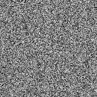
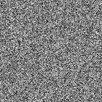

# Random Number Generator

!!! tip "Random Number Generator"

	This package handles random number generation different that the JavaScript package.  This difference affects:
	
	- `init()`
	- `setRNG()`
	- `getConfig()`
	
	

	!!! warning "Random Data CAN Be Captured"

		Capturing the random data used to generate shares is possible.  It's __not__ enabled by default and the `function()` necessary to process the random data is at the discretion users of this package.  
	
		The ability to access the random data is __solely__ intended for random dithering _(like the images below)_.
	
	=== "secrets"
		{ align=left }

		The `secrets` module is used for generating cryptographically strong random numbers suitable for managing data such as passwords, account authentication, security tokens, and related secrets.

		The `secrets` module __should be used__ instead of the default pseudo-random number generator in the `random` module, which is designed for modelling and simulation, not security or cryptography.

	=== "random"
		{ align=left }
		

		!!! warning "Warning"

			The pseudo-random generators in the `random` module __should not__ be used for security purposes. For security or cryptographic uses, use the `secrets` module. 		

	=== "testRandom"
		{ align=left }

		!!! danger "Do Not Use"

			__For testing purposes only!__
			
			The `testRandom` function serves as useful tool for development, generating predictable values. However, when it comes to applications involving security or cryptography, it's crucial to employ a robust random number generator. 
		
