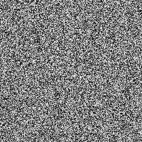

# JS2PySecrets

!!! danger "Work in Progress"

	The Python implementation of Shamir's Secret Sharing is currently under development.  
	
	It doesn't work just yet, but it's progressing.


Python implementation of Shamir's Secret Sharing.

$q(x) = a_0 + a_1x + \dotsi + a_{k-1}x^{k-1}$

!!! note ""

    The primary goal of this project is to create a Python implementation of Shamir's
    Secret Sharing that interoperates with an existing JavaScript implementation.

<!--
/// html | inline


            <div class="row">
                <div class="col-sm-6">
                    <h2>Split</h2>
                    <div>
                        Require
                        <input class="required form-control" type="number" value="3" min="2" max="255">
                        parts from
                        <input class="total form-control" type="number" value="5" min="2" max="255">
                        to reconstruct the following secret
                    </div>
                    <textarea class="secret form-control" rows=10 placeholder="Enter your secret here"></textarea>
                    <h2>Usage</h2>
                    <p>Double click each part below to select the content for that part. Copy and paste the content for each part into <span class="distributesize">5</span> individual files on your computer.</p>
                    <p>Distribute one file to each person in your group.</p>
                    <p>If <span class="recreatesize">3</span> of those people can combine the contents of their file using this page, they can view the secret.</p>
                    <p>Remember to delete the parts from your computer once you're finished. If you use a rubbish bin for deleted files, also remove them from the rubbish bin.</p>
                    <p class="error text-danger"></p>
                    <h2>Parts</h2>
                    <ol class="generated">
                        <li>Enter your secret above.</li>
                    </ol>
                </div></div>

///
-->
  
!!! example "Quick Comparison"

	Here's a quick overview of how Python will look, compared with the JavaScript implimentation.

	=== " :fontawesome-brands-python: Python"

		``` py
		import js2pysecrets as secrets
	
		key = "86A8E7"
	
		shares = secrets.share(key, 6, 3)
		
		recovered = secrets.combine(shares) # '86a8e7'
		```

	=== " :fontawesome-brands-square-js: JavaScript"

		``` js
		const secrets = require('secrets.js');
	
		var key = "86A8E7";
	
		var shares = secrets.share(key, 6, 3);
		
		var recovered = secrets.combine(shares); // "86a8e7"


		```


!!! danger "Random Data Can Be Captured"

	!!! danger "Random Data Can Be Captured"

		Capturing the random data used to generate shares is possible.  It's __not__ enabled by default and the `function()` necessary to process the random data is at the discretion users of this package.  
	
		The ability to access the random data is __solely__ intended for random dithering and auditing purposes.  _(like the images below)_
	
	=== "secrets"
		{ align=left }

		The `secrets` module is used for generating cryptographically strong random numbers suitable for managing data such as passwords, account authentication, security tokens, and related secrets.

		The `secrets` __should be used__ instead of the default pseudo-random number generator in the `random` module, which is designed for modelling and simulation, not security or cryptography.

	=== "random"
		{ align=left }
		


		!!! warning "Warning"

			The pseudo-random generators in the `random` module __should not__ be used for security purposes. For security or cryptographic uses, use the `secrets` module. 		

	=== "testRandom"
		{ align=left }

		!!! warning "Do Not Use"

			__For testing purposes only!__
			
			The `testRandom` function serves as useful tool for development, generating predictable values. However, when it comes to applications involving security or cryptography, it's crucial to employ a robust random number generator. 
		
